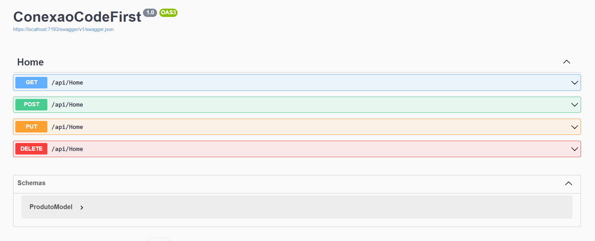

## Conexão com o Banco de Dados 

O objetivo deste projeto foi aprender a conectar o backend com o Banco de Dados SQL Server utilizando o ORM Entity Framework Core.
Foram utilizados métodos HTTP como o GET, POST, PUT e DELETE para fazer as requisições que buscam dados no servidor. POST: Método genérico para qualquer requisição que envia dados ao servidor; PUT: Método específico para atualização de dados no servidor; DELETE: Método específico para remoção de dados no servidor.

